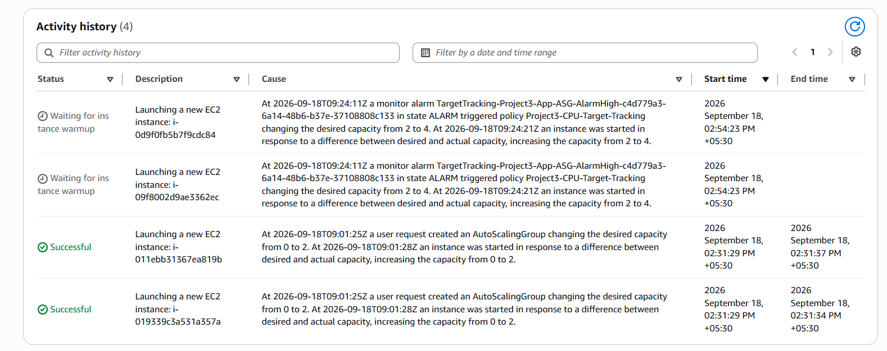
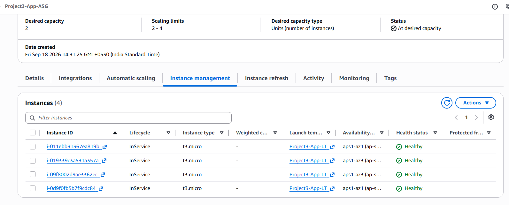
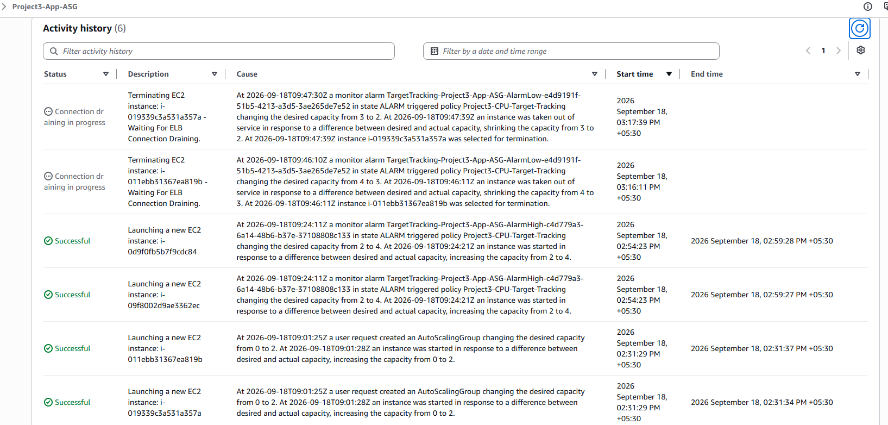
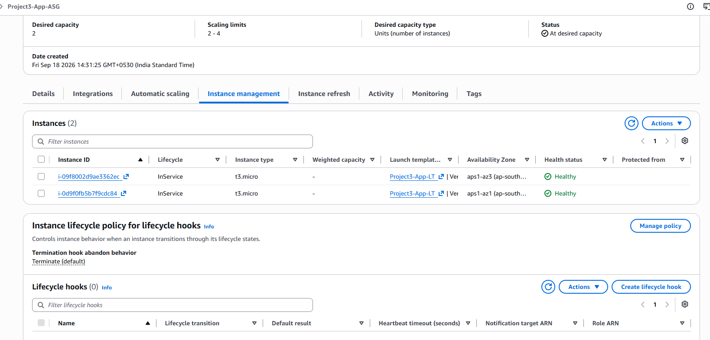
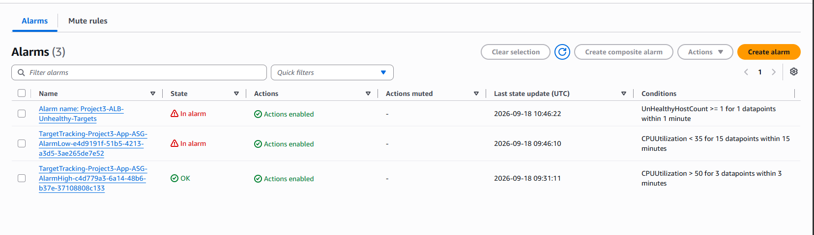
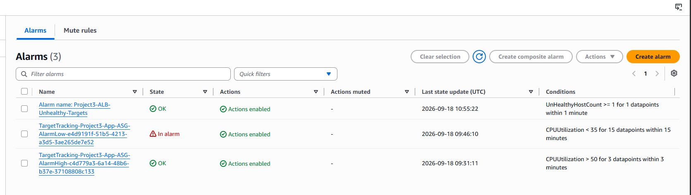

# Highly Available AWS Web Application

A hands-on AWS infrastructure project demonstrating a highly available application tier using private EC2 instances, an Application Load Balancer, Auto Scaling, Amazon RDS, CloudWatch monitoring, Route 53 DNS, and ACM-based HTTPS.

## Project Overview

This project was built to practice designing, deploying, monitoring, and troubleshooting a production-style AWS web application architecture.

The application tier runs across two Availability Zones and is managed by an Auto Scaling Group. An internet-facing Application Load Balancer distributes traffic to private EC2 instances, while Amazon RDS provides a private MySQL database tier.

CloudWatch and SNS were used for health monitoring and alerting. Route 53 and AWS Certificate Manager were used to provide custom-domain access over HTTPS.

> **Note:** The application tier is deployed across multiple Availability Zones. The RDS database instance used for this lab is Single-AZ to control lab costs.

## AWS Services & Technologies

- Amazon VPC
- Amazon EC2
- Application Load Balancer (ALB)
- EC2 Auto Scaling
- Amazon RDS for MySQL
- Amazon CloudWatch
- Amazon SNS
- Amazon Route 53
- AWS Certificate Manager (ACM)
- AWS Systems Manager (SSM)
- Security Groups
- NAT Gateway
- Internet Gateway
- Linux / Amazon Linux 2023
- Nginx

## Architecture

The infrastructure is deployed inside a custom VPC and separates public, application, and database resources into different network tiers.

Perfect. ✅ Architecture section is done.
Step 4 — Add Auto Scaling & High Availability
Edit README.md again and add this below the Architecture section:
## Auto Scaling & High Availability

The application tier uses an EC2 Auto Scaling Group to maintain application availability across two Availability Zones.

### Auto Scaling Configuration

- Launch Template: `Project3-App-LT`
- Auto Scaling Group: `Project3-App-ASG`
- Desired capacity: 2 instances
- Minimum capacity: 2 instances
- Maximum capacity: 4 instances
- Instances distributed across `ap-south-1a` and `ap-south-1b`
- EC2 and ELB health checks enabled
- Auto Scaling instances automatically install and start Nginx using launch template user data
- Instances automatically register with `Project3-App-TG`

A target tracking scaling policy was configured using average EC2 CPU utilization. The Auto Scaling Group can adjust capacity within the configured 2–4 instance limits based on application load.

## Monitoring & Alerting

Amazon CloudWatch was used to monitor the health of the application infrastructure.

A custom alarm named `Project3-ALB-Unhealthy-Targets` monitors the `UnHealthyHostCount` metric for `Project3-App-TG`.

## Auto Scaling Test

A target tracking scaling policy was configured for `Project3-App-ASG` using average CPU utilization with a target value of 50%.

To validate automatic scaling, CPU load was intentionally generated on the two application instances.

### Scale-Out Test

The application tier initially operated with:

- Desired capacity: 2
- Minimum capacity: 2
- Maximum capacity: 4

Sustained high CPU utilization triggered the target tracking policy. Auto Scaling automatically increased the desired capacity from 2 to 4 and launched two additional EC2 instances.

All four instances became healthy and InService behind the Application Load Balancer.

### Scale-In Test

After the artificial CPU load was stopped, utilization decreased.

The target tracking policy automatically reduced capacity from 4 back to the baseline of 2 instances. The additional instances were drained from the load balancer and terminated by Auto Scaling.

### Result

The test demonstrated automatic capacity adjustment based on application load:

**2 instances → High CPU → Scale out to 4 → CPU normalized → Scale in to 2**

The Auto Scaling Group maintained healthy application capacity across two Availability Zones throughout the test.

### Alarm Configuration

- Metric: `UnHealthyHostCount`
- Statistic: Maximum
- Period: 1 minute
- Threshold: Greater than or equal to 1
- Datapoints to alarm: 1 out of 1
- Missing data: Treated as not breaching
- Notification: Amazon SNS email alert

### Monitoring Test

The ALB health check path was temporarily changed to an invalid path to simulate unhealthy application targets.

The test successfully demonstrated:

1. ALB targets changed from Healthy to Unhealthy.
2. `UnHealthyHostCount` increased.
3. The CloudWatch alarm entered the ALARM state.
4. Amazon SNS delivered an email notification.
5. The correct health check path was restored.
6. Targets recovered and the CloudWatch alarm returned to OK.

### Monitoring Evidence

### Load Balancing

`Project3-ALB` distributes incoming requests across healthy application instances registered with `Project3-App-TG`.

The target group health checks ensure that traffic is sent only to healthy application instances.

### Network Design

- Custom VPC: `20.0.0.0/16`
- Two public subnets across two Availability Zones for the internet-facing ALB
- Two private application subnets across two Availability Zones for EC2 Auto Scaling instances
- Two private database subnets for the RDS DB subnet group
- Internet Gateway for public connectivity
- NAT Gateway for outbound internet access from the private application tier
- Separate route tables for public, private application, and private database subnets

### Application Traffic Flow

Internet User  
→ Route 53 (`app.goldenodisha.space`)  
→ HTTPS / ACM Certificate  
→ Application Load Balancer  
→ Target Group  
→ Auto Scaling EC2 Instances in Private Subnets  
→ Amazon RDS MySQL in Private Database Subnet

### Security Design

Security groups restrict communication between architecture layers:

- **ALB Security Group:** Allows HTTP/HTTPS traffic from the internet
- **Application Security Group:** Allows HTTP port 80 only from the ALB Security Group
- **Database Security Group:** Allows MySQL port 3306 only from the Application Security Group
- EC2 application instances do not require public IP addresses
- RDS is not publicly accessible
