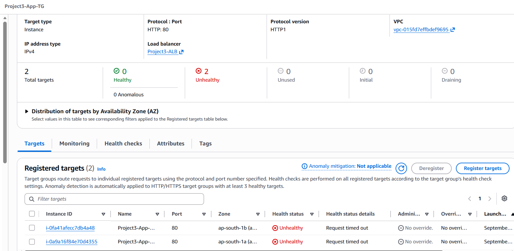
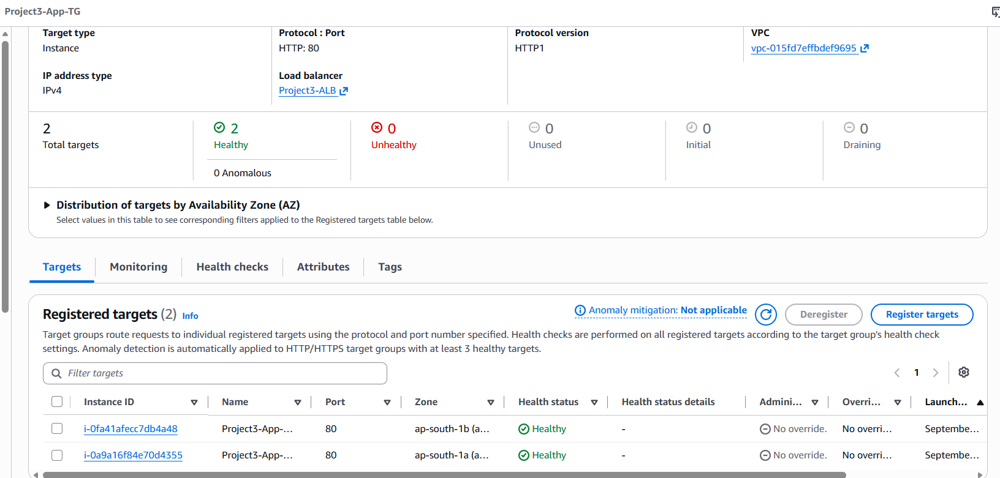

# Incident 1 — ALB Target Health Check Failure

## Scenario

A connectivity failure was intentionally introduced between the Application Load Balancer and the EC2 application tier to practice troubleshooting an unhealthy target group.

## Symptoms

- Both EC2 targets changed from Healthy to Unhealthy.
- Target health status reported `Request timed out`.
- The application endpoint returned a `504 Gateway Timeout`.

## Investigation

The following components were checked:

- Target group health status
- ALB listener and target group configuration
- Application Security Group rules
- Nginx service availability
- HTTP port 80 connectivity between the ALB and application instances

The Application Security Group was found to be missing the inbound HTTP port 80 rule allowing traffic from `Project3-ALB-SG`.

## Root Cause

HTTP port 80 traffic from the ALB Security Group to the application instances was blocked by the Application Security Group.

## Resolution

The following inbound rule was restored to `Project3-App-SG`:

- Protocol: HTTP
- Port: 80
- Source: `Project3-ALB-SG`

After restoring the rule, ALB health checks succeeded and both application targets returned to Healthy status.

## Evidence

### Targets Unhealthy

### Targets Recovered

## Key Learning

This incident demonstrated a layered troubleshooting approach for ALB-to-EC2 connectivity and showed how Security Group configuration directly affects target health and application availability.
