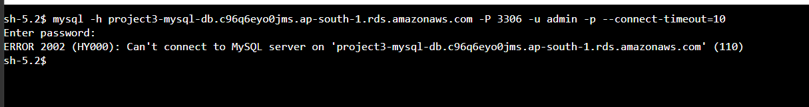
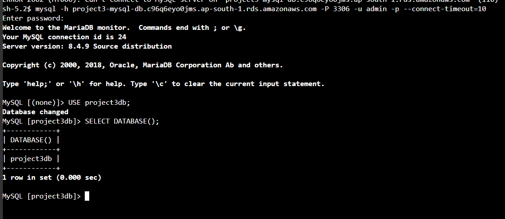

# Incident 2 — EC2 to RDS Connectivity Failure

## Scenario

A database connectivity failure was intentionally introduced between the private EC2 application tier and Amazon RDS to practice troubleshooting network and Security Group access.

## Symptoms

A MySQL connection from an EC2 application server to the RDS endpoint failed with:

`ERROR 2002 (HY000): Can't connect to MySQL server`

The RDS instance itself remained available.

## Investigation

The following components were checked:

- RDS instance availability
- RDS endpoint and MySQL port 3306
- Application and database Security Groups
- Network path between the private application and database tiers
- MySQL client connectivity from the EC2 application server

The Database Security Group was found to be missing the inbound MySQL rule allowing traffic from `Project3-App-SG`.

## Root Cause

MySQL traffic on TCP port 3306 from the application tier to the RDS database was blocked by the Database Security Group.

## Resolution

The following inbound rule was restored to `Project3-DB-SG`:

- Protocol: MySQL/Aurora
- Port: 3306
- Source: `Project3-App-SG`

After restoring the rule, the EC2 application server successfully connected to the private RDS MySQL database.

Database access was verified by selecting the project database and confirming the active database connection.

## Evidence

### RDS Connectivity Failure

### RDS Connectivity Recovered

## Key Learning

This incident demonstrated how Security Group references can securely control communication between application and database tiers and how to systematically troubleshoot EC2-to-RDS connectivity without exposing the database publicly.
